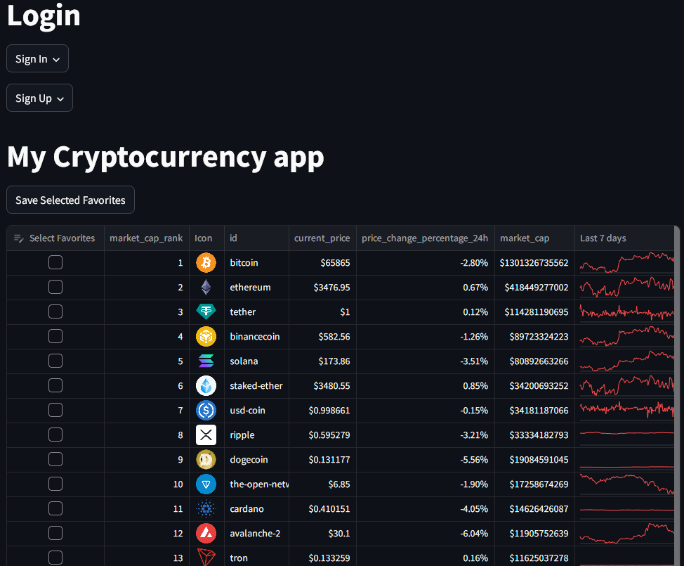

# CryptoLive

- [CryptoLive](https://crypto-api-71ok.onrender.com/) is a web application that displays live cryptocurrency prices.
- Users can sign up and sign in to favorite their preferred cryptocurrencies for quick access.
- Accessible from any device try it on your phone!
- (Note the application takes ~30 seconds to load if it has not been accessed for a while.)

## Table of Contents

- [Features](#features)
- [Technologies Used](#technologies-used)
- [Contact](#contact)

## Features

- **Live Cryptocurrency Prices**: View real-time prices of various cryptocurrencies.
- **User Authentication**: Sign up and sign in using JWT tokens for secure access.
- **Favorites**: Logged-in users can favorite their preferred cryptocurrencies for quick access.

## Technologies Used

- **Frontend**: Streamlit
- **Backend**: FastAPI, Python
- **Database**: MongoDB (hosted on Azure Cloud)
- **Authentication**: JWT tokens

## Links
- **Free Cryptocurrency Data**: [CoinGecko API](https://www.coingecko.com/en/api)
- **Free Hosting Platform**: [Render.com](https://render.com/)

## Contact

For any inquiries or questions, please contact:

- Your Name - [taran.s.lau@gmail.com](mailto:taran.s.lau@gmail.com)
- GitHub: [@unsupervised-machine](https://github.com/unsupervised-machine)